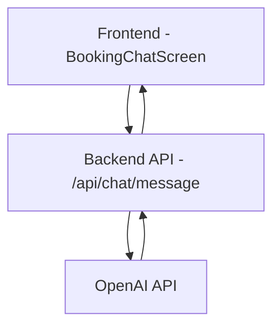

# Chatbot Architecture

## Component Description

1. **Frontend (BookingChatScreen.jsx)**
   - React component for the chat interface
   - Sends user messages to backend
   - Displays AI responses
   - Handles loading states and errors

2. **Backend API (/api/chat/message)**
   - Receives messages from frontend
   - Processes conversation history
   - Communicates with OpenAI API
   - Returns AI responses to frontend

3. **OpenAI API**
   - Processes natural language input
   - Generates contextual responses
   - Maintains conversation context

## Data Flow

1. User types a message in the chat interface
2. Frontend sends message to backend via POST request
3. Backend formats message for OpenAI API
4. Backend sends request to OpenAI with conversation history
5. OpenAI processes request and generates response
6. Backend receives response from OpenAI
7. Backend sends response back to frontend
8. Frontend displays AI response in chat interface